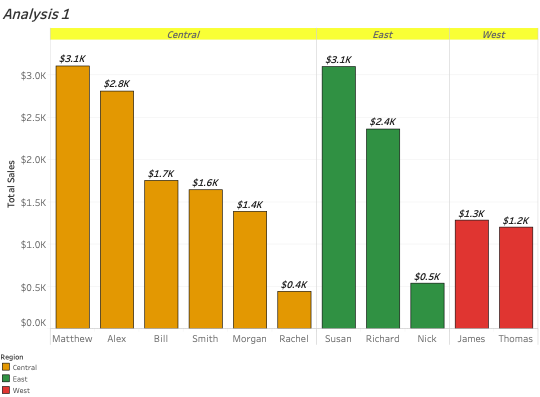
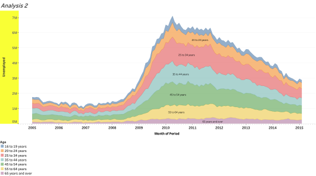
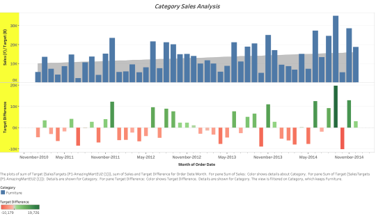
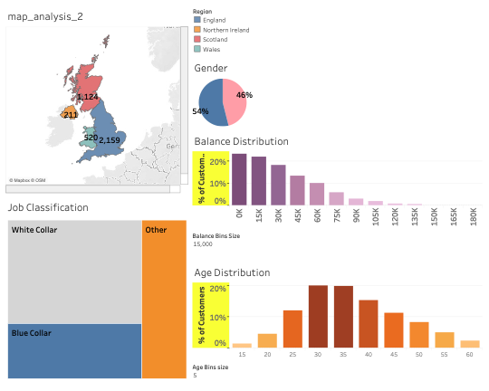

# TABLEAU WORK

## Bar Chart
- Total Sales by person, grouped by region

## Area Chart
- Unemployed count over a period, grouped by age

## Dual Axis
- Profit and Loss (Target value - Sale value) of a store grouped by category

## Bank Dashboard & Stories
- A Bank's Analysis on distribution of customers by gender, age, bank balance and job classification for every region in UK
- Detailed Stories for every region

